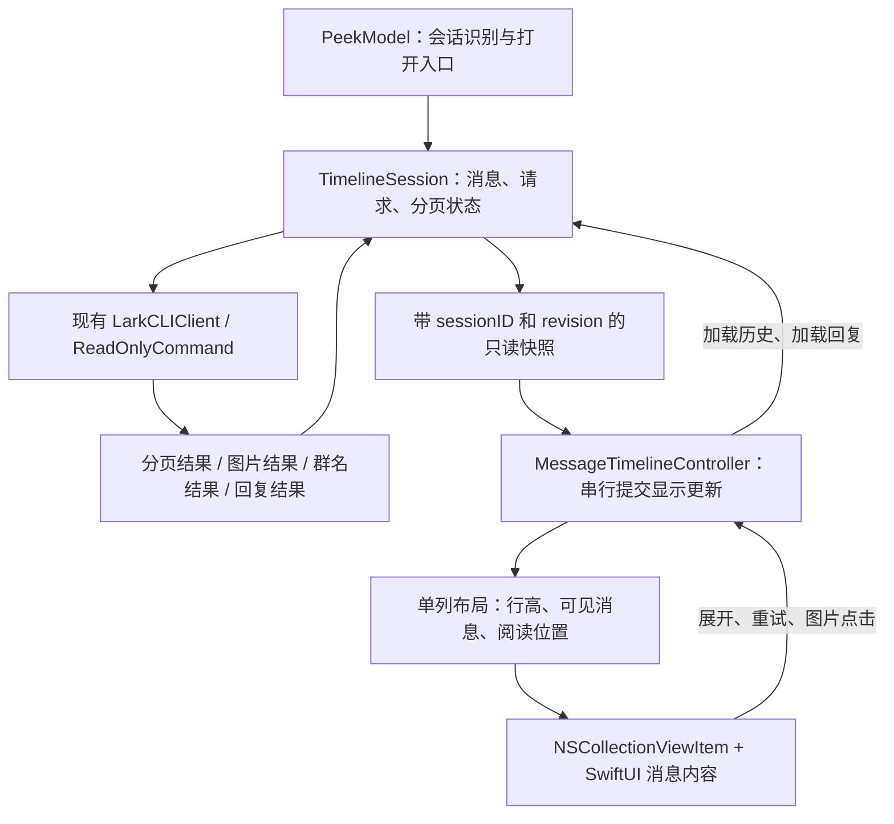

# 消息时间线重构方案

日期：2026-09-06。状态：主体实现已落地并通过自动测试；触控板惯性和鼠标操作的实机验收仍待完成。以下保留原设计依据，实际实现及验证记录见本节。

## 本轮实施记录

- 新增 `LarkPeekTimeline` target，使用 `NSCollectionView`、显式行高和单列布局。首屏一次定位，后续在布局提交时保存当前可见消息的位置；去除了旧 SwiftUI 时间线滚动观察和异步位置恢复代码。
- `MessageTimelineView` 和卡片从 PeekPanel 提取。展开状态按消息 ID 保存；测量和显示读取同一份不可变展开状态。点击更新只合并发生变化的展开项，防止复用行持有的旧状态覆盖其他卡片。
- 新增 `TimelineSession` 和 `TimelinePagination`。Session 统一拥有异步任务，用 sessionID/requestID 拒绝迟到结果；关闭动画期间冻结展示状态并废止写入权限。消息、群名、图片、回复改为各自更新负责的字段。
- 分页立即发布数据和游标，群名与图片独立补齐；无新增页最多连续查询三次，循环游标跨请求记录。失败、暂停、结束分别呈现，自动加载不能隐式重试失败页。
- 所有图片采用最大宽度 300 pt、高度 180 pt 的固定槽位，包括已缓存图片，以保持测量简单一致。根消息和回复图片都走同一 Session 资源队列，最多三个并发下载。
- 本次使用有序消息数组作为唯一数据源，保留现有去重/排序函数；尚未引入额外的 ID 字典或独立 TimelineSnapshot 类型。视图获取不可变消息值和带版本的行描述，Core 的 PeekState.messages 仅由 Session 派生发布。
- 后续更新默认保持阅读锚点，只有新 Session 首屏定位到底部。独立话题先取得回复再提交首屏；主动展开显式保持操作所在消息的位置，避免回复返回后跟随底部。

验证环境：macOS 26.5.1，项目最低部署目标仍为 macOS 14。`./Scripts/test.sh` 共 83 项通过，其中新增 19 项，覆盖异步交错、同会话重开、冻结关闭画面、分页与图片解耦、失败重试、空页/循环游标，以及真实 NSWindow 中的首屏、历史插入、长卡片展开和连续显示轮次。

合成长列表样本：1,020 条消息时有 7 个可见 item；插入历史后锚点误差为 0 pt。最新 Debug 样本中首次准备 1,000 行约 231 ms，新增 20 行约 14 ms。这些数字来自简单合成消息，不能代表真实富文本会话的耗时或峰值内存。

实际消息卡片已在原生容器中渲染并检查预览图。独立测试副本已成功启动并在检查后退出；桌面交互工具两次超时，尚未完成鼠标点击图片、触控板惯性和 macOS 14 的实机验收。原安装版本没有替换。

2026-09-07 后续修复：用户实测反馈阅读位置稳定，但滚动条常驻。仅在初始化关闭滚动条不足以生效；窗口测试及临时调用栈确认，NSCollectionView 会在内容尺寸、clip frame 和滚动 bounds 变化时重新启用滚动条。现由 TimelineScrollView 的公开属性覆写固定隐藏策略；回归测试覆盖实际卡片宿主、legacy/overlay 样式、翻页、滚动及窗口缩放，并校验滚动容器占满宽度。修复前新增断言失败，修复后共 84 项测试通过。临时诊断代码已移除。

## 1. 判断和范围

建议重构消息时间线。现有问题同时涉及异步数据发布、分页状态、行高变化和滚动位置所有权，继续添加恢复位置的回调很难建立稳定的行为约束。

采用一个负责消息状态的 `TimelineSession`，以及一个负责列表布局的 AppKit `MessageTimelineController`。列表建议使用 `NSCollectionView` 和单列自定义布局；消息内容继续使用 SwiftUI。这是消息时间线子系统的替换，保留窗口展示、快捷键、悬停识别、会话匹配、CLI、解析器及现有只读命令边界。

原生控件不会自动保证聊天列表不跳动。方案目标是让每次内容更新都有确定的布局、阅读位置和完成状态，并通过真实窗口验证。采用原生容器的最终落地，以第 10 节的布局原型验收为前提。

## 2. 重构前的源码证据

下面是静态代码可确认的缺口；没有留存分页日志证明用户最近一次现象具体命中了哪一条。

| 位置（重构前工作区） | 原有行为 | 后果或风险 |
| --- | --- | --- |
| `PeekPanel.swift:846`、`:920` | 首条 ID 变化后异步恢复，任务结束后也恢复；两处都会清理快照 | 恢复与真实布局没有明确同步关系，过早恢复会失效，过晚恢复会出现中间画面 |
| `PeekPanel.swift:906` | 请求开始前保存位置 | 用户在网络等待期间继续滚动，完成后可能回到旧位置 |
| `PeekPanel.swift:1012` | 用整个文档高度变化补偿 | 无法区分变化在阅读位置上方还是下方；只在上方变化时成立 |
| `PeekPanel.swift:1185` | 图片从单行占位变成最高 240 pt 的内容 | 下载会改变几何尺寸，当前快照可能已经释放 |
| `PeekModel.swift:538`、`:543` | 首屏先发布消息，群名查询返回后再发布完整旧数组 | 即使图片写回已改为 merge，群名写回仍可能覆盖等待期间加入的分页或回复 |
| `PeekModel.swift:338`、`:340` | 分页用请求前的数组合并，再等待群名解析后整批发布 | 期间完成的其他字段更新可能丢失；该 await 后也没有紧邻发布的会话校验 |
| `PeekModel.swift:311`、`:341` | 分页 loading 包含图片下载；只有两个分页布尔值 | 已经有文字仍转圈；失败和无新增页的 UI 状态不明确 |
| `PeekModel.swift:363` | 分页失败只写 `statusMessage` | 浮窗恢复同一个“加载更早消息”按钮，用户看不到失败原因 |
| `PeekModel.swift:813`、`PeekPanel.swift:859`、`LarkPeekApp.swift:170` | 回复、分页、首屏任务分散在三个位置管理 | 取消和会话生命周期难以统一；仅检查 chatID 不能区分同一会话的两次打开 |
| `PeekPanel.swift:1335`、`:1413` | 展开状态存在卡片自己的 `@State` 中 | 接入原生行复用后，状态必须按稳定 ID 保存，不能跟随复用视图 |
| `PeekPanel.swift:1702` 附近 | 顶部监听只判断几何阈值跨越 | 程序布局变化与用户主动上滚没有明确区分 |

重构前未提交的图片 merge 修复方向正确，新增测试也已保留，但它只验证数组合并，不覆盖实际异步交错。重构前的测试基线为 64 项，全部通过；这不是 UI 稳定性的验证。

## 3. 技术路线比较

| 路线 | 优点 | 对本项目的主要问题 | 判断 |
| --- | --- | --- | --- |
| 保留 SwiftUI ScrollView，继续补恢复回调 | 改动小 | 仍缺少统一的布局提交边界，维护多套滚动逻辑 | 不作为长期方案 |
| SwiftUI List / 新滚动 API | 与现有 UI 接近 | 仍须解决异步状态、动态行高和复用；不能把换 API 视为解决问题，且须考虑 macOS 14 下限 | 不作为本次首选 |
| NSTableView，显式行高 | 单列实现简单，有原生复用 | 可实现，但仍需自建阅读锚点和高度更新事务；自动行高会使用估算值 | 合理备选 |
| NSCollectionView，单列自定义布局 | 布局对象掌握 item 几何，并有更新和偏移调整接口 | 需要少量专用布局代码，SwiftUI 测量与滚动惯性必须实测 | 推荐，先验证关键原型 |
| WebView 聊天列表 | CSS 布局方案丰富 | 增加第二套渲染、交互和桥接体系，需重新处理图片预览、选择和可访问性 | 当前收益不匹配成本 |

选择 CollectionView 的依据是它能把阅读位置策略纳入布局，而不是它比所有其他控件天然更稳定。首版只实现单列，不引入通用布局框架、第三方聊天 SDK 或复杂索引树。

苹果公开了更新前的布局回调和 SwiftUI/AppKit 托管方式：[CollectionView 更新准备](https://developer.apple.com/documentation/appkit/nscollectionviewlayout/prepare(forcollectionviewupdates:))、[Use SwiftUI with AppKit](https://developer.apple.com/videos/play/wwdc2022/10075/)。本机 SDK 头文件也确认提供 `contentOffsetAdjustment`、`targetContentOffsetForProposedContentOffset:`；这些接口的存在不等于已验证无动画更新时的完整行为。

## 4. 职责划分



`TimelineSession` 在 MainActor 上修改状态，不在锁或 UI 事务中执行网络工作。它统一拥有首屏、分页、群名、图片和话题请求的任务句柄。`PeekModel` 继续处理会话路由，逐步把时间线状态的写权限交给 Session；迁移期如保留 `PeekState.messages`，它只能是派生兼容输出，不能成为另一个可写列表。

原生控制器独占滚动位置和布局更新。SwiftUI 消息卡片接收展示数据和动作回调，不再直接持有分页 Task，也不自行通知滚动容器纠正位置。

建议文件边界：

- `LarkPeekCore/TimelineSession.swift`：状态、会话代次、请求身份、事件应用。
- `LarkPeekCore/TimelineSnapshot.swift`：展示快照、分页状态及稳定消息 ID。
- `LarkPeekTimeline/MessageTimelineController.swift`：AppKit 列表、用户滚动与更新协调。
- `LarkPeekTimeline/MessageTimelineLayout.swift`：布局结果、锚点与高度缓存。
- `LarkPeekTimeline/MessageRowView.swift`：从 PeekPanel 提取的内容渲染及卡片。

把原生时间线放进独立 SwiftPM target 是为了让应用和 AppKit 集成测试使用同一份实现。该 target 依赖 Core；窗口和图片放大控制器仍在应用 target，通过回调连接。若拆分中需要共享图片点击参数，将图片和屏幕矩形定义为该 target 的明确输出类型，避免依赖应用内的 private 类型。

## 5. 数据更新规则

### 5.1 会话和请求都有身份

每次打开、重试、重新选择或关闭预览都会使旧 sessionID 失效，即使 chatID 相同也一样。每个请求另有 requestID；所有结果、失败、取消及清理动作，只有匹配当前 sessionID 和活动 requestID 才能修改状态。

取消用于及时停止工作，身份校验用于阻止迟到结果生效，两者都保留。关闭动画期间可以展示冻结的最后快照，但应立即废止旧请求的写权限，而不是等动画结束才处理。

### 5.2 只应用请求负责的字段

Session 内保留有序消息 ID 和按 ID 存储的内容。异步任务返回以下结果，而不是返回它开始时捕获的完整列表：

| 结果 | 允许修改的内容 |
| --- | --- |
| pageReceived | 消息基础字段、有序 ID、分页游标 |
| imageResolved | 指定 messageID + imageKey 的资源状态 |
| sharedChatResolved | 对应 sharedChatID 的展示名称 |
| repliesReceived | 对应 threadID 的回复集合与状态 |
| expansionChanged | 指定消息/卡片的展开状态 |

分页中的重复原始消息不能清除已下载图片、已解析名称和已加载回复。图片或群名任务不能改变顶层消息集合和游标。回复图片使用回复 messageID 寻址，不依赖父消息数组的旧副本。

图片成功状态不能被更早的失败结果降级；资源身份变化时才重置状态。保留现有请求去重、临时文件清理和缓存策略，明确资源调度的并发上限作用于 Session 内所有调用，而不只是一次 downloadImages 调用。

每次有效更新递增 revision，产生不可变展示快照。控制器可以合并尚未应用的快照，但始终从“当前显示版本”计算到“最新待显示版本”的变化，不能假定中间版本都已显示。

### 5.3 分页完成和资源完成分离

网络分页结果通过校验后，消息和下一页游标在一次状态更新中生效；随后独立补齐群名、图片和回复。不能先推进游标，再等待一个可取消的群名查询才发布消息。

布局测量属于本地显示步骤。测量未完成时继续显示旧列表；控制器完成提交后再解除本次显示更新的入口门控，避免短暂使用新游标配旧界面再次触发分页。

## 6. 阅读位置与布局

### 6.1 位置是阅读锚点，不是请求开始时的文档高度

普通阅读时保存 `messageID + 该消息顶部相对视口顶部的位置`，选择第一条可见消息，允许它部分露出。在新快照已经准备好、即将替换当前布局时采样，不跨网络等待持有位置快照。

以向下为正的统一坐标表示：

```text
screenY = oldFrame(anchorID).minY - oldViewport.minY
newViewport.minY = newFrame(anchorID).minY - screenY
```

这使阅读位置下方的增长不影响视口，上方的增长只补偿锚点实际位移。不要用整个文档总高度差替代锚点位移。

锚点消息不在新快照中时，选旧顺序里最近的仍存在消息；找不到再使用边界策略，并记录退化原因。遇到真正的边界钳制，偏移可能无法保持，测试必须区分该情况。

### 6.2 明确不同更新的定位策略

| 场景 | 策略 |
| --- | --- |
| 新 Session 首屏 | 已知首屏行高后定位到底部，再显示列表；短内容保持底部对齐 |
| 加载更早消息 | 保持提交前的阅读锚点，优先于底部跟随，即使原内容不足一屏 |
| 图片结果 | 固定媒体框内替换内容，不触发布局高度变化 |
| 群名等局部变化 | 重测受影响行，保持阅读锚点 |
| 用户展开/折叠话题或转发卡片 | 在点击时锁定操作标题的位置，允许用户主动要求的内容展开 |
| 回复异步返回 | 重新采样当前阅读位置；若当前正在看该 loading 区域，保留回复标题位置并呈现结果 |
| 首屏补齐内容，且用户仍在底部 | 保持底部；用户已经向上阅读时不抢回底部 |
| 用户继续滚动或惯性滚动 | 按提交时最新位置计算，程序偏移不产生新的用户翻页意图 |

超长消息可以高于视口。`messageID + offset` 保证消息内部的几何阅读位置，但不能承诺任意正文重排后仍是同一个字。当前关键异步变化通过固定图片框、独立回复状态降低这种重排；对话题标题采用子区域锚点。若原型显示一个超长复合卡片仍需要保持内部段落，则将根消息、回复、转发条目拆成稳定的展示子项，再合成现有卡片外观，避免继续追加滚动补丁。

### 6.3 布局一次提交

控制器按如下顺序执行：

1. 从最新快照识别新增/变化行，用实际宽度和展示状态测量行高。
2. 测量期间旧画面保持可滚动；准备完成后校验 sessionID 和 revision，过期结果作废。
3. 在 MainActor 的无 await 提交段中采样当前阅读锚点，应用数据变化、行高与目标偏移。
4. 插入使用 CollectionView 批量更新，行高变化走布局失效上下文。偏移由布局统一计算，区分更新类型，禁止同一更新在多个钩子中重复补偿。
5. 原生布局确认提交完成后发送 appliedRevision；清理的是本次更新上下文，不能清除下一次更新。

`prepare(forCollectionViewUpdates:)`、`targetContentOffset`、`contentOffsetAdjustment` 是实现候选接口。需要在原型中确认无动画批量插入和失效更新的实际调用顺序。不能把 completion 回调当作首次画面出现前的时机，也不能声称一个 MainActor 同步段天然等于屏幕原子更新。

首版禁用自动数据更新的尺寸/位置动画。显式展开如果要保留动画，必须由控制器掌握几何过程；在此之前采用即时展开，不能继续让卡片中的 `withAnimation` 自行改变父列表高度。

完成后删除旧 `ScrollViewReader`/`ScrollPositionPreserver`/`ScrollViewResolver`/`ScrollTopObserver` 这一套定位与分页协调。首屏定位也由同一原生布局负责，不再叠加 SwiftUI `.defaultScrollAnchor`。

### 6.4 行高和复用

测量与显示使用同一 SwiftUI RowView、相同宽度、字体和状态；缓存键至少包括展示 ID、几何版本、宽度、字体环境和展开状态。高度按 backingScale 向上取整。只测量首屏及新增/变化行，不在每帧重测所有消息。

行高由原生布局明确提供，显示中的 HostingView 不以未协调的 intrinsic-size 变化自行改变 item 几何。缓存缺失时先准备真实高度再插入，避免用估算高度先显示一帧。复用视图必须按 ID 绑定；展开状态在 Session 的展示状态中保存，图片点击使用当前绑定 ID 和点击时的屏幕矩形。

首版用数组和高度缓存即可；布局更新可做 O(n) 的位置累计，可见区查询用二分。逐页增长时复用视图降低视图数量，但并不自动解决数据和图片长期驻留，应保留已有资源限制并测量峰值内存，不在本次引入历史消息淘汰机制。

## 7. 图片和卡片尺寸契约

当前 `MessageImage` 只有 key、data 和 attempted，没有可直接使用的源尺寸。不能假设接口已经提供宽高。

首版建议：缓存中已有尺寸时，在首次进入展示快照前选定比例；未知尺寸使用固定预览槽位（建议最大宽度 300 pt、高度 180 pt，最终以视觉验收为准），槽位内 aspect-fit。加载中、成功、失败都保持该槽位高度；本次展示生命周期不因下载完成重新选择比例。

这会让部分横图或竖图周围有留白，换来加载过程中列表几何稳定。点击仍展示原图。后续如验证现有响应可可靠提供尺寸，可在首次展示前计算比例，无需增加为了测量而发出的远端请求。

话题和转发卡片的展开状态按消息 ID 保存。测量用的 RowView 不启动网络任务、不修改业务状态；实际点击才发出加载动作。群名解析允许更新对应内容，但只影响相关行，并经过同一个布局提交入口。

## 8. 分页状态与触发规则

分页至少需要这些互斥状态，而不是两个布尔值：

| 状态 | 用户看到的内容 | 下一步 |
| --- | --- | --- |
| ready(cursor) | 加载更早消息 | 主动点击或向上滚动触发 |
| loading(requestID, cursor) | 正在加载更早消息 | 合并重复触发，不并发请求同一页 |
| failed(cursor, reason) | 加载失败 · 重试 | 用户明确重试，保留已显示内容 |
| paused(cursor, reason) | 本次未读到更早消息 · 继续查找 | 允许主动继续，停止自动循环 |
| exhausted | 已到最早消息 | 停止请求 |

顶部状态区在同一 Session 内保持固定高度；用单行摘要和明确动作承载错误，详细原因可通过帮助提示展示，避免它自身改变消息位置。

从当前状态和返回数据计算新增 ID 数，而不是把 API pageCount 当新增数。重复/空页但游标仍前进时，允许一次操作最多连续查询 3 个无新增页面；仍无新增进入 paused，保留下一次可用游标。游标缺失才是 exhausted；重复或循环游标属于异常暂停，不能伪装成“没有更多”。重试不会清空已显示消息。

自动加载要求明确的用户向上浏览意图，包括滚轮、触控板、键盘或滚动条操作。初始布局、程序偏移、图片更新、分页提交不能触发它。先保留当前接近顶部触发方式；阈值可后续调整，提前预取不是解决正确性的前提。

一次用户触发意图只启动一次逻辑分页操作；视口仍在顶部不自动连续翻页。离开顶部区域后重新进入，或新一次向上操作、点击按钮，才重新获得触发资格。内容不足一屏时按钮始终可用，首次布局不自动扫完整个历史。

## 9. 可验证的验收标准

### 数据与异步测试

使用可控制完成顺序的测试数据源；不依赖 sleep 来“碰巧”制造竞态。保留现有 CLI 集成测试和命令边界测试。

- 初始群名查询未返回时分页完成，随后群名返回：历史消息不减少。
- 图片、话题回复、分页任意交错：互不覆盖各自负责的字段。
- 同一 chat 连续打开两次，旧请求在新请求后完成：旧消息、错误和清理均不影响新 Session。
- A→B→A、关闭过程中返回结果：不会串会话；任务最终结束并释放资源。
- 连续重复页、空页、循环游标：符合有界请求和状态反馈规则。
- 失败后重试：保留内容，游标正确，成功后没有残留错误。
- 快照合并跳过中间 revision：最终显示所有有效结果。
- 图片成功后晚到失败：不降级；回复图片能按正确 ID 更新。

### 原生布局与视觉测试

测试必须使用应用实际的原生时间线组件，并在真实 NSWindow 中完成布局。纯 Core 测试无法验证 AppKit 的显示时序。

| 场景 | 验收 |
| --- | --- |
| 纯文字顶部插入 20 条 | 用户静止且无边界钳制时，原可见锚点屏幕位置变化不超过 1 个物理像素 |
| 请求未返回时用户滚动到另一条消息 | 返回后保持提交前的新阅读位置，不回到请求开始处 |
| 连续惯性上滚并完成分页 | 滚动保持连续，无反向拉回；对照轨迹区分用户位移和更新附加位移 |
| 上方/下方图片乱序完成或失败 | 媒体槽位高度不变，不导致整个视口移动 |
| 空消息、短首屏、超长首屏 | 首次可见列表的位置正确，无顶到底纠正或空白区域 |
| 长消息、长 Markdown、转发、话题展开 | 测量和显示一致；状态经行复用仍保持，操作标题不突然消失 |
| 失败、无新增、最后一页 | 文案准确、可重试、无自动请求风暴 |
| 图片点击与行复用、滚动交错 | 原图匹配当前消息，放大起点仍是点击的缩略图 |
| 20 / 200 / 1000 条混合内容 | 记录首次显示、提交耗时、帧间隔、托管视图数量和峰值内存 |

增加每次布局提交的 sessionID、revision、更新原因、新增 ID 数、锚点位移和边界钳制原因日志；不记录消息正文、会话名或完整游标。日志证明几何不变量，逐帧录屏检查是否存在错误中间画面，两者不能互相替代。

目标是已定义场景下可测的稳定性，不承诺所有 macOS 版本、任意内容变化或设备负载下“百分百无闪动”。在最低支持的 macOS 14 和当前系统都验收；缺少对应环境时明确列为未验证。

## 10. 实施顺序与停止条件

1. **先验证原生布局原型。** 使用合成消息，在真实窗口验证无动画 prepend、异步行高变化、请求期间滚动、短内容和超长行；包含 HostingView 测量及图片点击。原型必须验证实际显示帧和锚点误差。若只能靠延时、反复 scrollTo 或全列表 reload 才稳定，不进入集成阶段，先修正布局方案。
2. **统一数据状态。** 引入 Session、请求身份和字段更新，补全异步交错测试。短期通过适配层接旧视图，单独证明消息不再被覆盖、分页结果明确。
3. **接入原生时间线。** 提取现有 RowView，迁移展开状态和媒体尺寸，接入已通过原型的布局。删除旧滚动观察/恢复路径。开发期间保留内部切换入口以便对照，不做长期双实现。
4. **验证并收尾。** 运行现有 Core 测试和新集成测试、真实窗口录屏、构建与签名校验；再按用户授权安装测试版本。体验验证通过后删除开发切换入口。

这四步属于一个完整重构目标，每步可独立审查。布局原型是技术风险验证，不应被包装成修复已经完成。

现有三个未提交文件保持可追溯：保留图片 merge 的保护语义和回归测试；在 Session 接管对应路径后改用字段更新；原滚动补偿代码在新布局接管时移除。实现时不先整体回退用户工作区。

## 11. 原设计的技术风险清单

布局与数据主体实现的最新状态见文首实施记录。

无动画批量更新、HostingView 测量和长行几何已经过窗口集成测试；触控板惯性、真实会话复杂卡片及图片放大点击仍需实机复测。若长卡片内部阅读仍存在问题，再按第 6 节的边界拆分展示子项，不能把自动测试通过作为所有交互已验证的证据。
